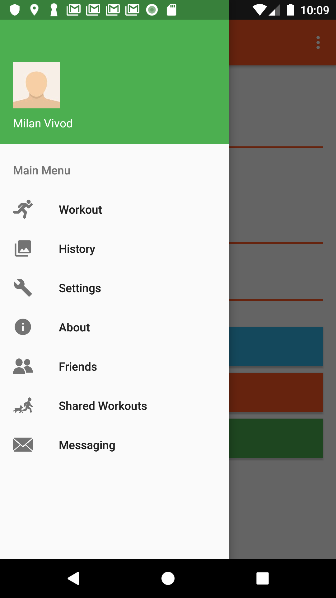
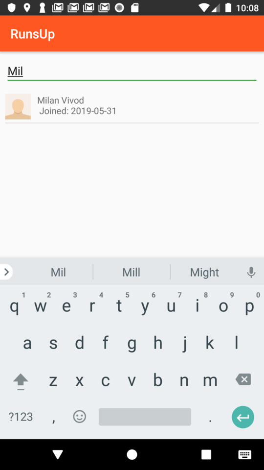
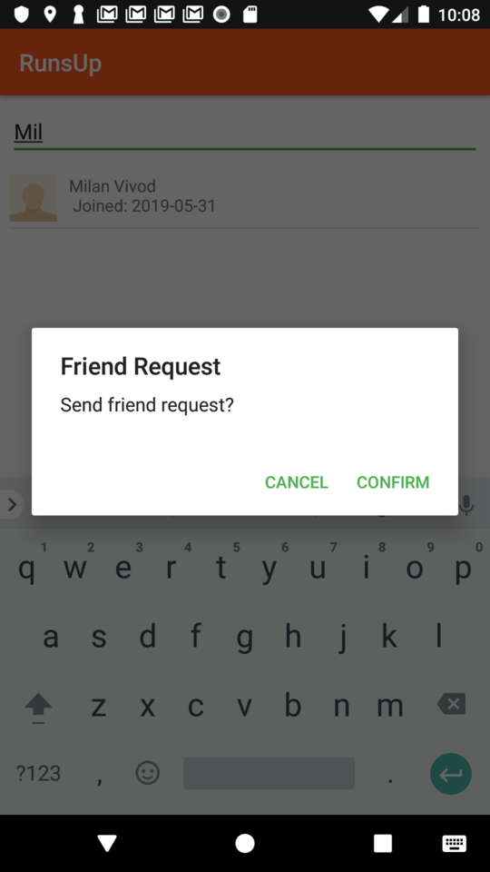
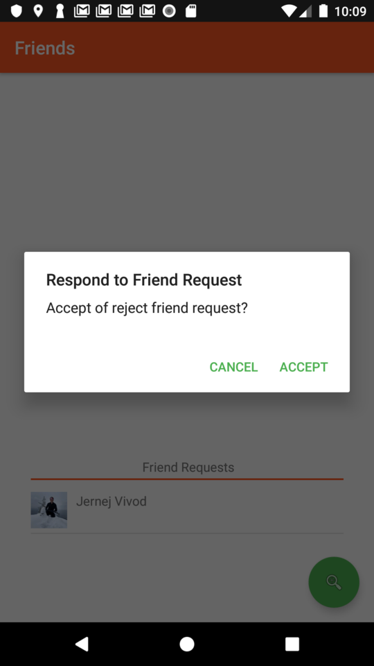
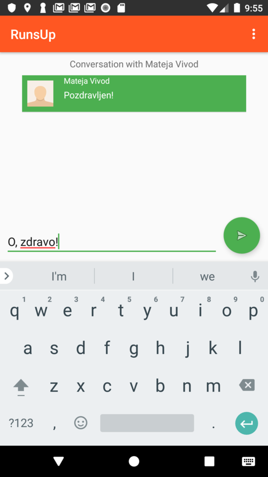
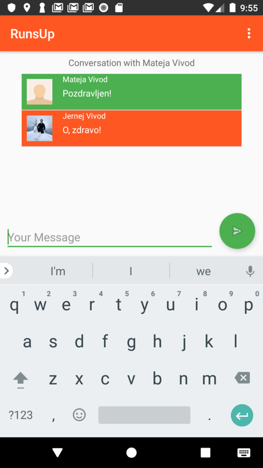
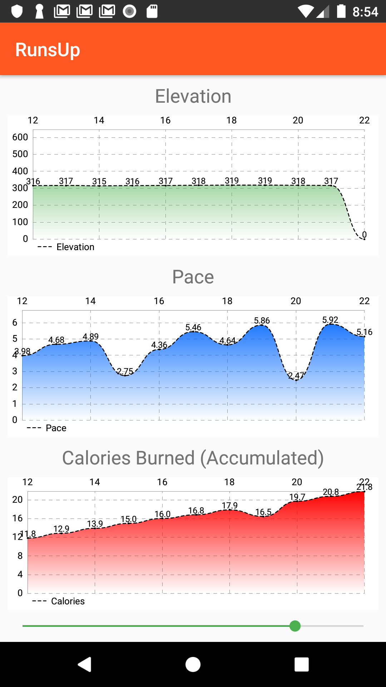

jv6916@student.uni-lj.si
Jernej Vivod
Project for the Platform Based Development class as taught in the spring semester, 2019.
com.google.android.gsm:play-services-location:16.0.0

During the fourth sprint, the application was extended to include searching for friends, sending friend requests, sending private messages to friends and viewing visual representations of various workout parameters.

As the user logs into the application, they are immediately put into the cloud database upon first interaction with any cloud functionality such as searching for friends, etc. 
Other users can then search for the person and send them a friend request, as can be seen in the following images. The ability to share workouts is implemented on the back-end and also almost completely implemented on the client.

The receiver of the friend request can respond to the friend request or reject it. If the friend request is accepted, both users are added to each other's friends lists.

Friends can send each other private messages. The messaging functionality can be reached through the main drawer or by clicking on a list view item representing a specific friend and choosing the option 'Send Message'. 
The user can also remove a friend using this dialog. 

When the workout is ended, the user can access a visual representation of various workout parameters (elevation, pace and cummulative calories with respect to time). 
The visualization was created using the MPAndroidChart library. An example of the visual representation is shown in the following image. The user can use the slider at the bottom to inspect parts of the workout in specified time intervals.

The back-end is implemented using the Express framework and is hosted on Heroku. 
The databased was created using MLab service.

The source code for the back-end can be found in the project folder.

The functionality can be tested using the .gpx file in the project folder that contains the GPS measurements of a Ljubljana half-marathon run.

IMPORTANT: The back-end on Heroku sometimes hibernates and takes a while to restart.